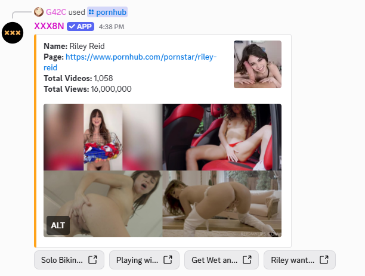

# 🍑 Porn Hub BOT  


A powerful and easy-to-use bot to automate and manage content.  

---

## 📌 Features
✅ Easy setup  
✅ Fast and lightweight  
✅ Built with **Node.js**  
✅ Active support through our Discord community  

---

## 💻 Requirements  

Before starting, make sure you have installed:  

- [Node.js](https://nodejs.org/) (latest version)  
- [npm](https://www.npmjs.com/) (comes with Node.js)  

---

## 🚀 Installation and Startup  

1. Clone this repository or download the `.zip`  
2. Configure the `.env` file from `.env.example`:  

```env
TOKEN="YOUR_BOT_TOKEN"
````

3. Install the dependencies:

```bash
npm install
```

4. Start the bot:

```bash
npm start
```

---

## 🤝 Community & Support

Have questions or want to share ideas about the project?
Join our **official Discord** and be part of the community:

👉 [**Join Discord**](https://discord.gg/d2wzVNjxGU)

---

# Image Embed Preview (1)

<div align="center">
  
</div>

# Image Embed Preview (2)

<div align="center">
  
</div>
